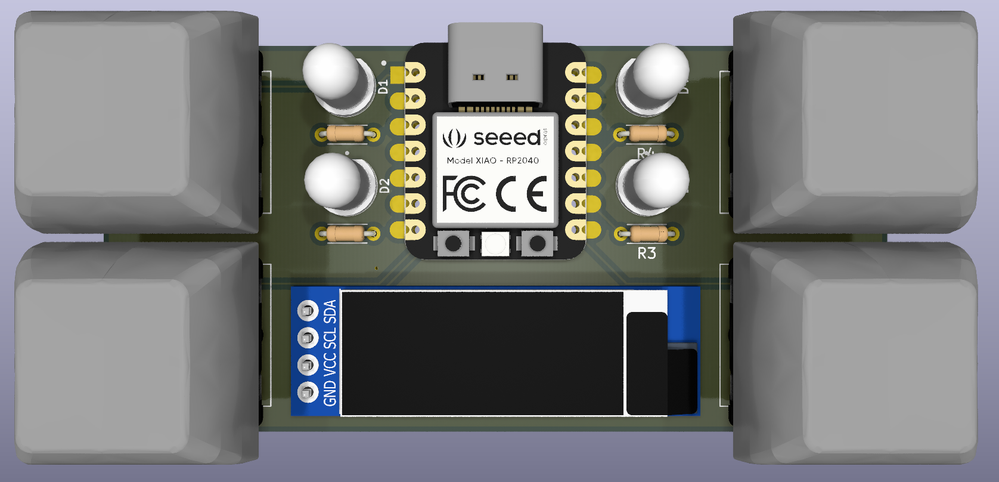
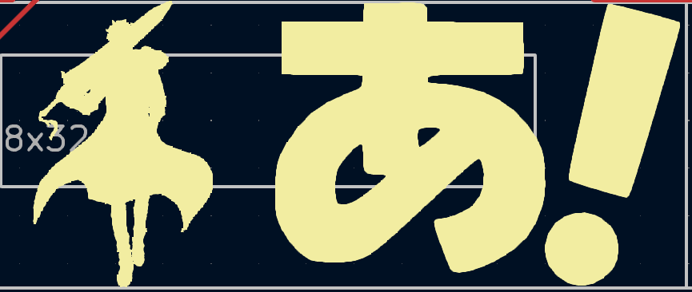

# skyfinder

This is a gamepad with 4 MX-style switches, 4 LEDs, and a 128x32 OLED display.. The game can be played by watching the LEDS to find out which switch to press. The difficult part is that the LEDs don't tell you which switch to press now, they tell you which switch you'll have to press next, adding a layer of memory (cache if you will) to the game.  
Optionally, if you want to make it harder, try pressing the keys on time! A timing wil be determined based on your first few key presses, and your accuracy will be displayed on the OLED screen.  
  
there's also a couple anime related easter eggs on the pcb

anime nerd? click here

there's not much but here you go i guess:  
  
sung jinwoo and that one kana that shows up a lot in azumanda daioh  
imgs/dandadan.png  
this one isn't really hidden but it's the guy from dandadan  

